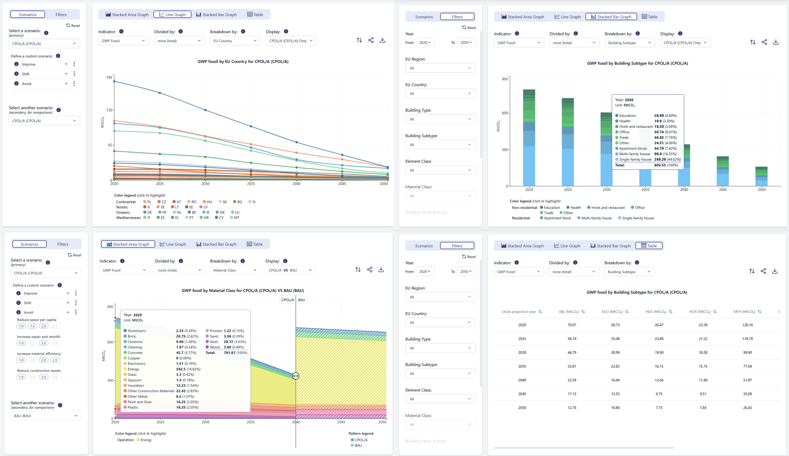
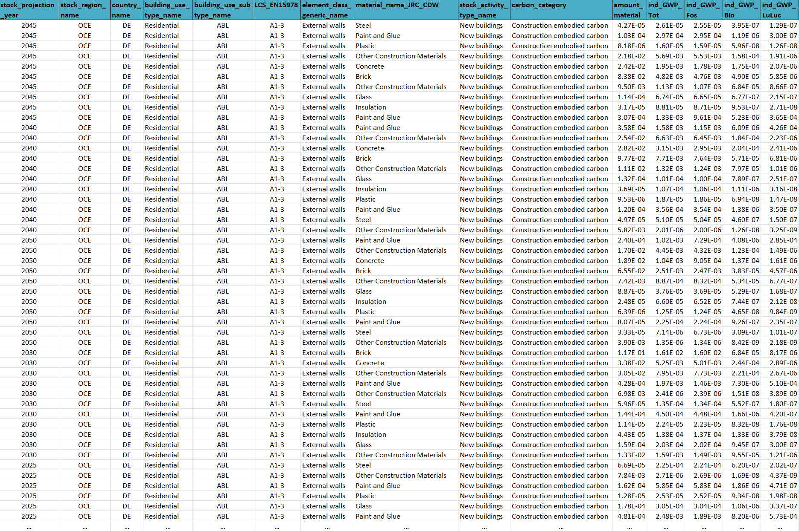

# Summary

Buildings account for approximately 40% of CO2 emissions in the European Union over their life cycle, making the built environment sector crucial for achieving Europe's 2050 climate neutrality targets. While operational emissions have traditionally been the focus of reduction efforts, there is growing recognition of the need to also reduce embodied emissions and facilitate carbon removals through a whole life cycle (WLC) approach. Comparative data on WLC emissions across countries, building types, and emission reduction strategies, however, remains limited, particularly at national and EU building stock levels [@Roeck2021EnvMod].
Here, we present the `WLC-Scenario-Explorer` which enables analysis of predefined scenarios and exploration of strategy combinations across different ambition levels. The tool offers various scenario parameters, affecting embodied and/or operational emissions, and considering the feasibility and effectiveness of different approaches to achieving climate neutrality by 2050. Trade-offs and synergies between different parameters can also be explored.
This tool contributes to enabling effective communication of the evidence base needed for informed policy design and implementation in the building sector and is aimed at researchers, industry leaders, and policy professionals at local, national, and transnational level.

# Statement of need
The `WLC-Scenario-Explorer` was developed to enable a comprehensive understanding of complex WLC scenario results on carbon reduction and removals potentials in EU buildings and construction. The underlying study included modelling WLC impacts of the EU building stock, assessing different emission reduction strategies, and improving data availability for future assessments of the European building tock. The objectives for developing this tool included to establish a user-friendly tool to illustrate potential WLC emission outcomes of various predefined as well as explorative, custom scenarios.

# Modelling building stock whole life cycle emissions
## Bottom-up building stock life cycle modelling framework
Through advanced scenario modelling combining high-definition life cycle assessment (LCA) data on representative building archetypes obtained via the SLiCE-MMG model [@Roeck2024SLiCE] with upscaling analyses based on the PULSE-EU building stock activity and scenario model [@Alaux2024PULSEAT], we examine carbon reduction and removal (CRR) strategies categorized into three main approaches: Avoid (reduce material and energy demand), Improve (enhance conventional materials, processes) and Shift (transition to low-carbon alternatives) [@Alaux2024CRRS]. 

## Defining scenarios and model parameters
The scenario results in this tool are generated using a custom modelling pipeline combining building archetype data from the SLiCE model (2) with upscaling and scenario analyses based on the PULSE model [@Alaux2024PULSEAT]. The detailed methodology as well as the collection of scenario results data is published separately [@Alaux2025EUWLCPathways].
* Predefined policy scenarios: To enable swift exploration of key scenarios, users of the WLC Scenario Explorer can select predefined policy scenarios, established based on wider EU policy goals for improving energy efficiency and advancing decarbonization action in context of buildings and construction.
* Alternative explorative scenarios: The WLC Scenario Explorer tool enables exploration of alternative scenarios by defining custom values for diffusion of strategy packages – see Table 1. 
These packages group Avoid/Shift/Improve measures presented by @Alaux2024CRRS to simplify the tool and improve usability. To modify the alternative scenarios, users can define the intensity of implementation (diffusion) assumed across the EU Member States (MS), based on four setpoints: 0,0 (0% diffusion, BAU) / 0,5 (50% diffusion) / 1,0 (100% diffusion) / 10 (‘high’ diffusion across all MS, overwriting prior limitations of MS capacity for implementation [@Alaux2024CRRS]).

# Exploring scenario results and contributions
Upon selection of a predefined policy scenario and/or definition of an alternative explorative scenario users can start investigating the results. As illustrated in Figure 1, users can select to investigate various aspects of the results, including: (top left) the interface for scenario selection and/or custom definition (left bar) as well as WLC results per Member State visualized as line graphs; (top right) the option to filter the results (left bar) and explore the contribution of different building types, in stacked bar graphs; (bottom left) the default stacked bar chart and additional information available via the tooltip (when hovering over the graph with your mouse) during comparison of two scenarios side-by-side via the slider; (bottom right) the presentation of results in table format, applying breakdown attributes as defined by user.

# Data requirements for scenarios results
The `WLC-Scenario-Explorer` expects scenario results data following an adapted version of the SLiCE scalable life cycle engineering tabular data format. The tool does work with incomplete datasets, automatically limiting functionality to those attributes (columns) where data is provided for both key and value attributes [@Roeck2024SLiCE], as shown in Figure 2. 

As a recommended scope and structure of the data, we recommend the following key and value attributes to be included in the scenario results dataset. Key attributes are available in filter settings as well as for adjusting the 'Breakdown by' option. The different value attributes can be selected via the 'Indicator' option, as well as for selecting alternative 'Divide by' options. Adjustments of both key and value attributes, including related default values or units, is possible through adjustments in the underlying code in order to update the options displayed for filter and breakdown attribute selection.

Key attributes (list of default values provided in square brackets)
* 'stock_projection_year': [2020, 2025, 2030, 2035, 2040, 2045, 2050]
* 'stock_region_name': [CON, OCE, MED, NOR]
* 'country_name': [AT, BE, BG, CY, CZ, DE, DK, EE, EL, ES, FI, FR, HR, HU, IE, IT, LT, LU, LV, MT, NL, PL, PT, RO, SE, SI, SK]
* 'building_use_type_name': [Residential, Non-residential]
* 'building_use_subtype_name': [ABL, EDU, HEA, HOR, MFH, OFF, OTH, SFH, TRA]
* 'LCS_EN15978': [A1-3, A4, A5, B2, B4, B5, B6, C1, C2, C3, C4]
* 'element_class_generic_name': [Electrical services, External openings, External walls, Internal openings, Internal walls, Roofs, Storey floors, Substructure, Energy, Technical services, Staircases]
* 'material_name_JRC_CDW': [Cleaning, Other Construction Materials, Concrete, Glass, Paint and Glue, Steel, Sand, Gypsum, Ceramics, Plastic, Energy, Aluminium, Other Metal, Copper, Electronics, Wood, Brick, Insulation, Process]
* 'stock_activity_type_name': [Existing buildings, Refurbishment, New buildings]
* 'carbon_category': [Use phase embodied carbon, Use phase operational carbon, Demolition embodied carbon, Renovation embodied carbon, Construction embodied carbon]

Value attributes (expected units provided in square brackets)
* 'amount_material': [kg/m²]
* 'ind_GWP_Tot': [kgCO2e/m²]
* 'ind_GWP_Fos': [kgCO2e/m²]
* 'ind_GWP_Bio': [kgCO2e/m²]
* 'ind_GWP_LuLuc': [kgCO2e/m²]
* 'stock_floor_area_Mm2': [Mm²]
* 'population_country': [unitless]

# Acknowledgements

This work links to EU project "Analysis of Life-cycle Greenhouse Gas Emissions and Removals of EU Buildings and Construction” [GROW/2022/OP/0005] contracted by European Commission (EC), DG GROW. The author’s opinions expressed here do not represent the EC's official position. The authors are grateful for the partnership and collaboration of the whole study team - including colleauges at Ramboll, BPIE, KU Leuven, TU Graz, PoliMi, AAU, and IIASA, as well as external partners - which made it possible, to develop nnot just the underlying analysis, but also this open tool aimed at offering an accessible way of exploring the outcomes of this and hopefully many other similar analyses in the future.

# References